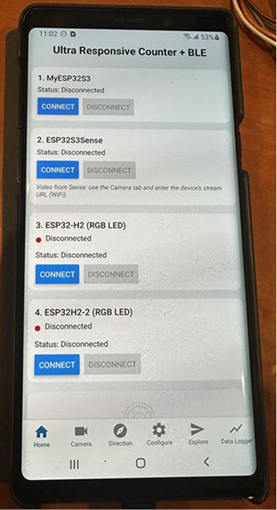
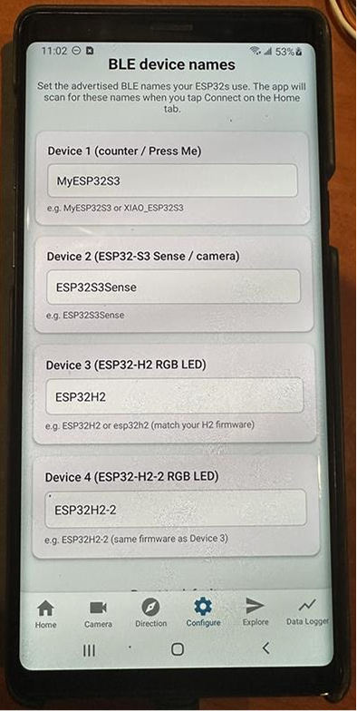
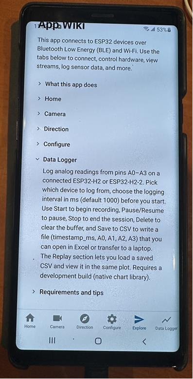
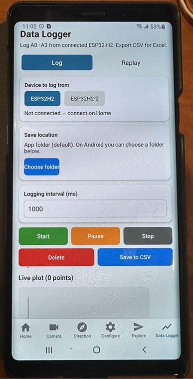
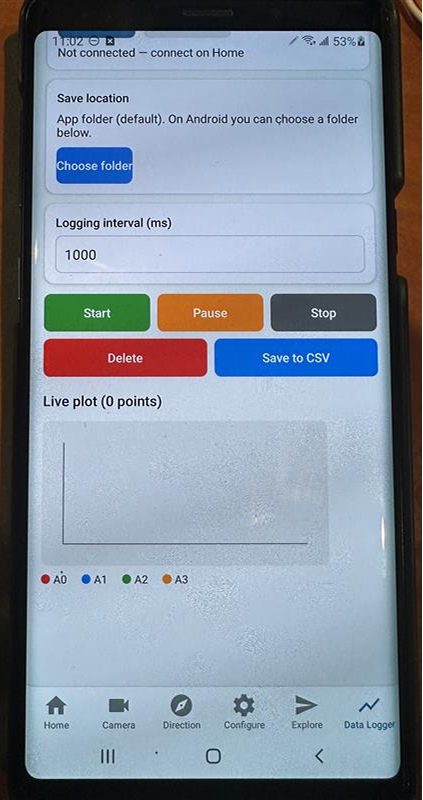
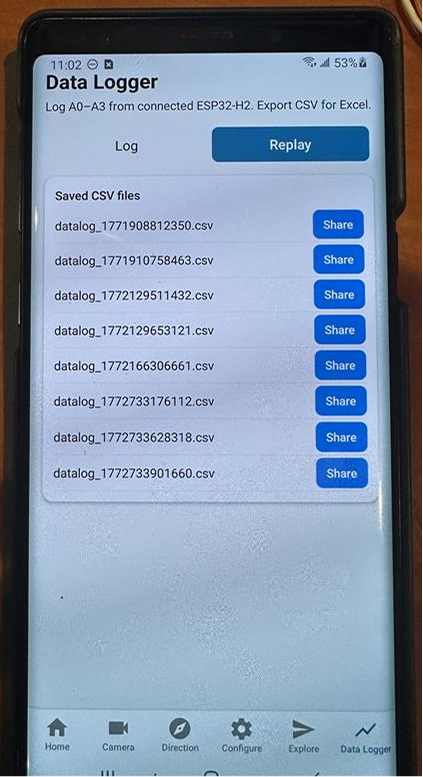
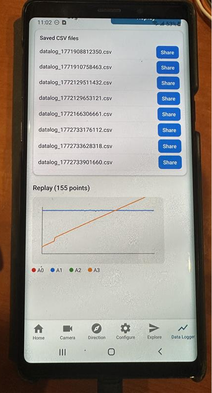

# BleAppDataLogger — Android APK tester guide

This folder contains the shared Android APK used to test BLE telemetry with the Uno R4 firmware in `ArduinoCodes/SDLCDUnoR4_BLE_power_logger`.

## APK download link (OneDrive)

- Download APK: [Georgia Tech OneDrive link](https://gtvault-my.sharepoint.com/:u:/g/personal/hpark416_gatech_edu/IQAEFjp0PFz6RINSzdOIHQ8iAeCZKCqanrhHqFeCn2UBu3I?e=rJOoXT)
- Access note: this file is hosted on a Georgia Tech OneDrive tenant, so access is generally limited to users with Georgia Tech accounts (GT students/staff).

## Tester Instructions: Install Shared APK on Android

1. Download the APK file to your Android phone.
2. Open the file from **Downloads** (or from your browser's download list).
3. If Android blocks install, enable **Install unknown apps** for the app you used (Chrome/Files/Drive), then return to the APK.
4. Tap **Install**.
5. Tap **Open** and confirm the app starts correctly.

## If installation fails

- **App not installed:** uninstall any existing copy of the app, then install again.
- **Parse error:** re-download the APK (file may be incomplete/corrupted).
- **Play Protect warning:** only continue if you trust the APK source.
- **No prompt appears:** open the APK from **Files > Downloads** and retry.

## Quick validation after install

- App launches without crashing.
- Main screen loads.
- Required test feature works (**BLE/device connect flow** for this project).

## How this relates to `SDLCDUnoR4_BLE_power_logger`

The Arduino firmware advertises a BLE peripheral and publishes battery telemetry in a format the app can parse:

- **BLE name:** `ESP32H2-2`
- **Service UUID:** `12345678-1234-1234-1234-1234567890ab`
- **Characteristic UUID:** `12345678-1234-1234-1234-1234567890af`
- **Characteristic payload:** ASCII CSV `v100,i100,p100,wh100` (scaled by x100)
- **Update rate target:** about 10 Hz (`SERIAL_INTERVAL_MS = 100`)

For successful app testing, verify the board is powered, BLE advertising is active, and your phone has Bluetooth permissions enabled for the app.

## UI screenshots

### Home and navigation

### Data Logger — log view

### Data Logger — replay view

